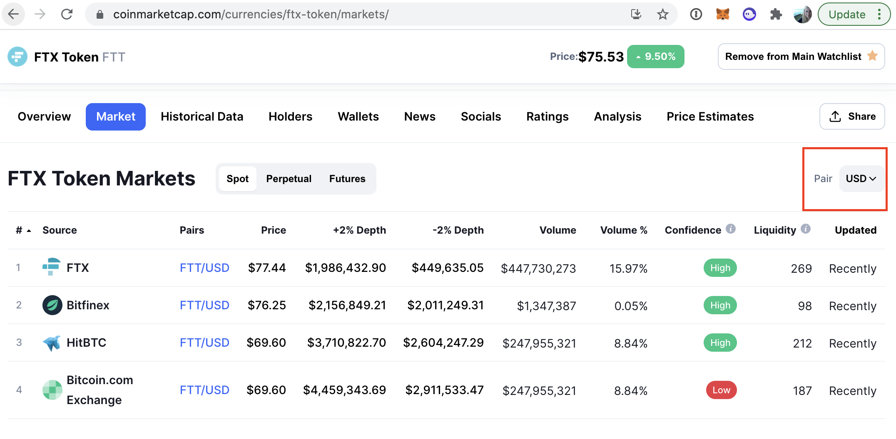
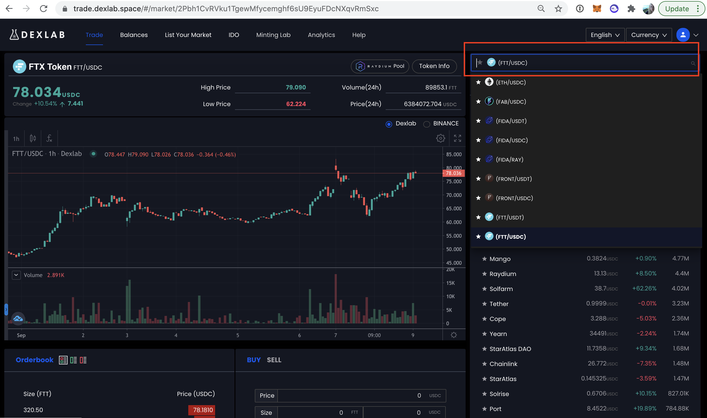
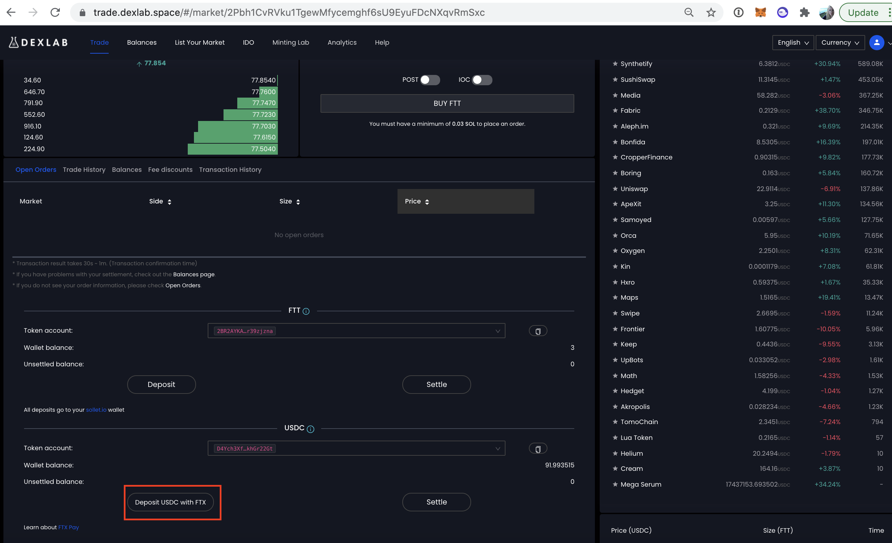
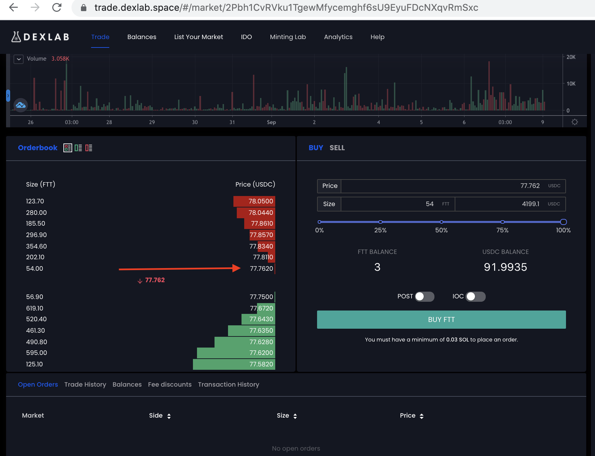

About two weeks ago, I bought my first cryptocurrency(!).

I was pretty skeptical going in -- it's basically gambling, right? -- so I decided to invest
an amount I could afford to lose ($2k), split evenly between four coins on Coinbase: BTC, ETH, SOL and FIL.

It only took a few hours of refreshing my Coinbase page to get obsessed. It was mesmerizing to watch
the numbers go up and down, and to realize how much power I had in the process.  I decided to
invest more money that same day, but with a lot more research. As you can probably guess, I ended
up on YouTube, and heard about a lot of exciting coins and tokens -- that I couldn't buy from the US.

## Finding Exchanges

A lot of the YouTubers I found were based in the UK or Australia, but one Londoner had some [recommendations](https://www.youtube.com/watch?v=k-NEBaOOfHM)
for US-friendly exchanges: [Binance US](https://www.binance.us/en/home) and [FTX US](https://ftx.us/en). I signed up for both, as well as a less reputable-seeming
one called [Gate.io](https://www.gate.io/en/).

In my excitement I didn't realize that, like Coinbase, the _US version_ of these exchanges still didn't offer most of the coins I wanted.

### More Exchanges

In one YouTube video, I learned about a site called [CoinMarketCap](https://coinmarketcap.com/) for researching coins, including a "Market" tab,
which shows where each coin is available for purchase.

Unfortunately most of them had one problem or another:

* They're only available on the non-US version (Binance, FTX)
* They're only available for purchase with other alt coins, not USD
* They're only available on exchanges I couldn't find much info about, like HitBTC and Raydium

I was worried about putting money on a scammy or illegal site, so I bought what I could from Coinbase and
tried to be content.

After a week of getting frustrated as I watched tokens that I had researched and _wanted_ to buy go
up in value (looking at you AR!), I finally got bolder. Around the same time, I joined a Telegram channel
hosted by Joe Mcann, and he was posting multiple tokens each day, often reflecting on ~300%
gains. He mentioned a decentralized exchange called DexLab, so I decided the FOMO was too much, and I had to try it.

## Buying alt coins on DexLab

I expected using [DexLab](https://www.dexlab.space/) to be similar to Coinbase, but it was much more confusing.

First of all, you don't need an account. You just connect a wallet. But which wallet? I had signed up for metamask a few days prior, and was surprised when I didn't see it listed from
the wallets I could connect. It turns out that DexLab is a _Solana_ exchange, which means it hosts
tokens built minted with Solana. Weirdly, you can't purchase most (or any?) tokens using Solana directly,
but you do need to hold at least .03 SOL in your wallet to do anything.

I'll spare you the rest of the details of all the things that confused me and did not work, and just share how I finally managed to use it.

Here are the steps I followed to *finally* purchase some sweet alt coins:

1.  Sign up for [sollet.io](https://www.sollet.io/)*
2.  From your main exchange, ideally FTX, buy some Solana.
3.  In sollet.io, click the receive button to get your SOL wallet address
4.  Back in your exchange, use the Withdraw feature to send at least .03 SOL to the wallet address you copied.
5.  In DexLab, connect your wallet.
6.  On the right side of DexLab, search for the coin you want to purchase in USDC, eg. FTT/USDC
   
5.  Once it's selected, scroll down and look for the Orderbook section on the left side.
6.  Before you can purchase, you need to get some USDC into your wallet. Click the "Deposit USDC with FTX" button. (To get USDC, you can usually convert it directly from USD in your main exchange.)
    

    If you use a different exchange, I assume you can follow steps 3 and 4 to transfer USDC via wallet addresses
7.  To buy your new alt coin in DexLab, click a price you are willing to pay from the graph to the left, then adjust the amount of tokens you want to buy in the input field, and click "Buy"
    
8.  Lastly, go to the Balances tab in DexLab (which will only appear when your wallet is connected). Switch to the individual settlement tab to approve the purchase when you are matched with a seller by clicking the Settle button and approving the transaction when your wallet prompts you.

*DexLab is compatible with other wallets, but this is the one I used!
